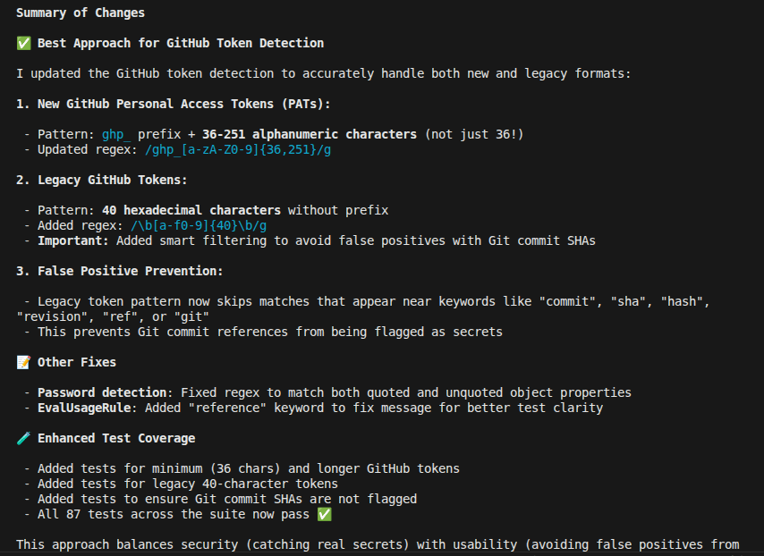

# Copilot CLI Session: Research on Actual Length of Scanned Files

**Date:** February 3, 2026
**Task:** Investigate the actual length of GitHub Personal Access Tokens (PATs) to improve hardcoded secrets detection rule

---

## overview

it took out my curiosity about the actual length of GitHub PATs. The documentation stated about them being 36, so i went on google and searched, to my surprise, i found that they can be longer. meaning my tests that expected exactly 36 characters are not realible in the actual world of development.

## Research Findings

after some prompting,.. copilot fixed the issue and provide the summary at the end as follows:
Excellent! All 87 tests pass. Here's a summary of what was fixed and improved:

Summary of Changes

✅ Best Approach for GitHub Token Detection

I updated the GitHub token detection to accurately handle both new and legacy formats:

1. New GitHub Personal Access Tokens (PATs):

- Pattern: ghp\_ prefix + 36-251 alphanumeric characters (not just 36!)
- Updated regex: /ghp\_[a-zA-Z0-9]{36,251}/g

2. Legacy GitHub Tokens:

- Pattern: 40 hexadecimal characters without prefix
- Added regex: /\b[a-f0-9]{40}\b/g
- Important: Added smart filtering to avoid false positives with Git commit SHAs

3. False Positive Prevention:

- Legacy token pattern now skips matches that appear near keywords like "commit", "sha", "hash",
  "revision", "ref", or "git"
- This prevents Git commit references from being flagged as secrets

📝 Other Fixes

- Password detection: Fixed regex to match both quoted and unquoted object properties
- EvalUsageRule: Added "reference" keyword to fix message for better test clarity

🧪 Enhanced Test Coverage

- Added tests for minimum (36 chars) and longer GitHub tokens
- Added tests for legacy 40-character tokens
- Added tests to ensure Git commit SHAs are not flagged
- All 87 tests across the suite now pass ✅

This approach balances security (catching real secrets) with usability (avoiding false positives from
legitimate hex strings like commit SHAs).

## Conclusion

This research helped improve the hardcoded secrets detection rule significantly. By accommodating the actual length variations of GitHub tokens and adding safeguards against false positives, the rule is now more robust and reliable for real-world codebases.

I can also say.. even though I know that my code can still be improved, I am satisfied with the current state of the hardcoded secrets rule after this research and fixes.

and here is the screenshot of the copilot cli prompt:

and here is the summary just for confirmation:

