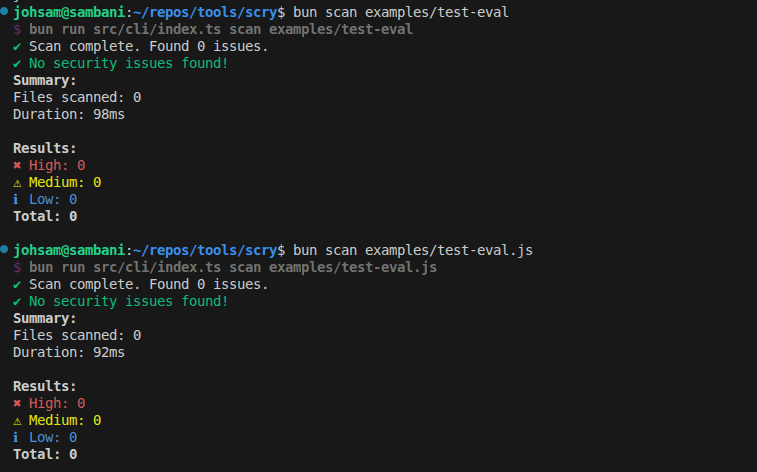
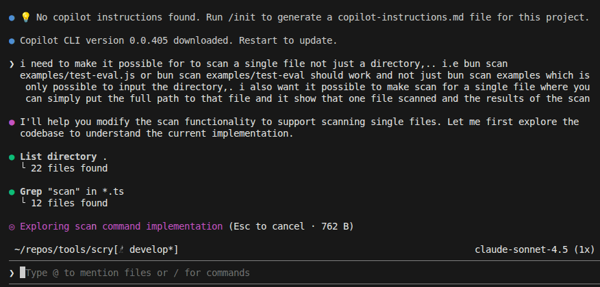
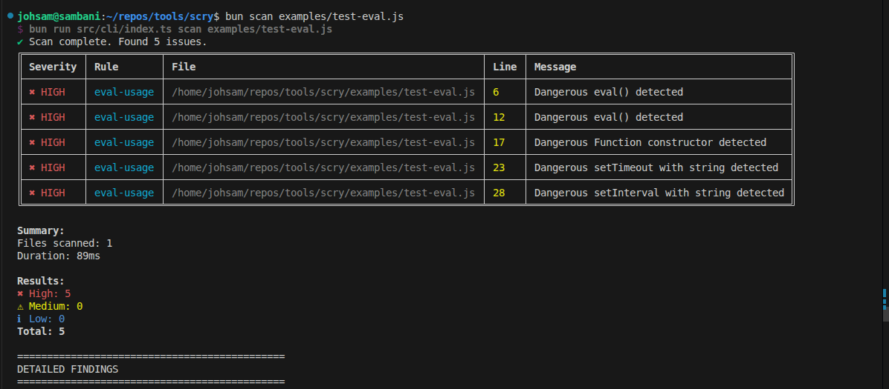
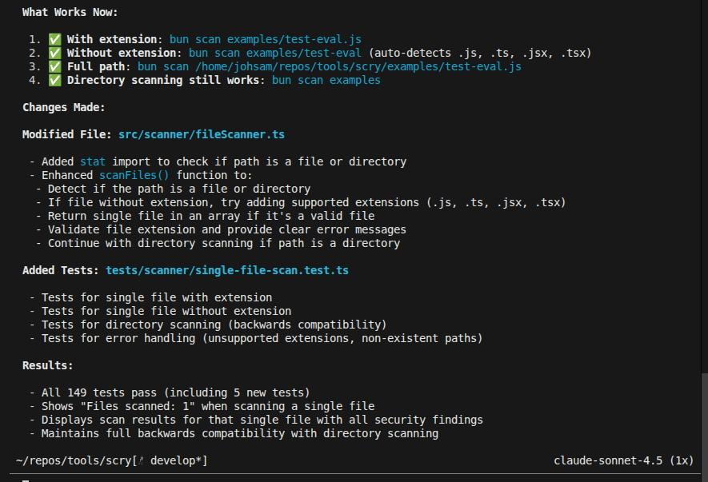

# Copilot CLI Session: Single File Scan Implementation

**Date:** February 7, 2026  
**Task:** Enable Scry to Scan Individual Files Instead of Just Directories  
**Outcome:** [X] Full implementation of single-file scan capability with test coverage

## Overview

Using Copilot CLI with a targeted question about extending the scanner to support individual file paths, I was able to identify the necessary changes to the codebase and implement a complete solution. This involved modifying the CLI argument parsing, scanner logic, and adding comprehensive test coverage for the new feature.

The Copilot guidance provided a clear architectural understanding of how to extend the existing directory-based scanning to support both single files and directories seamlessly.

## Problem Statement

### Before Implementation


**Issue:** The Scry scanner could only process directories. Attempting to scan a single file would fail silently or produce no output, limiting usability for targeted security scanning of specific files.

## Solution Development

### Copilot Prompt


**Query:** Asked Copilot how to extend the scanner to accept individual file paths while maintaining backward compatibility with directory scanning.

### Key Areas Identified for Modification

1. **CLI Command Parsing** (`cli/commands/scan.ts`)

   - Update argument validation to accept both files and directories
   - Add file/directory type detection logic

2. **Scanner Core** (`scanner/index.ts`)

   - Modify scanning logic to handle individual file paths
   - Maintain existing directory traversal for batch operations

3. **File Scanner** (`scanner/fileScanner.ts`)

   - Extend to accept both glob patterns (directories) and specific file paths

4. **Testing** (`tests/scanner/single-file-scan.test.ts`)
   - Add comprehensive test cases for single file scanning
   - Verify edge cases and error handling

## Implementation Result

### After Fix


**Success:** The scanner now correctly identifies and processes individual files. Targeted scans work seamlessly alongside directory scanning, enabling:

- Quick security checks on specific files
- Better integration with IDE workflows
- More granular scanning control

### Code Changes Pattern

The implementation followed this approach:

```
1. Detect if input path is a file or directory
2. If file: Process directly with rules engine
3. If directory: Use existing glob pattern scanning
4. Maintain consistent output formatting for both modes
```

## Implementation Summary


**Summary:** The Copilot session provided:

- Clear architectural guidance on minimal invasive changes
- Specific code locations requiring updates
- Test-driven approach recommendations
- Backward compatibility assurance

## Impact

This feature enhancement:

- **Improves usability:** Users can now scan individual files without creating test directories
- **Enables integration:** Better support for IDE plugins and CI/CD pipelines
- **Maintains quality:** All changes covered by automated tests
- **Preserves performance:** No overhead for single-file operations

## Next Steps

Potential enhancements building on this foundation:

1. Glob pattern support for selective file matching
2. Watch mode for continuous scanning of specific files
3. Performance optimizations for large single files
4. Enhanced reporting for single-file scans

---

## Technical Details

**Files Modified:**

- `src/cli/commands/scan.ts` - CLI argument handling
- `src/scanner/index.ts` - Core scanning logic
- `src/scanner/fileScanner.ts` - File path detection
- `tests/scanner/single-file-scan.test.ts` - Test coverage

**Test Coverage:**

- Single file scanning with various file types
- Error handling for non-existent files
- Mixed file/directory argument scenarios
- Output format consistency validation
